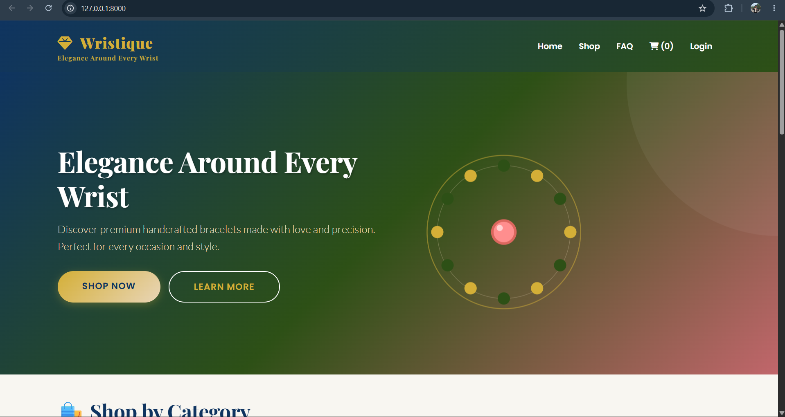
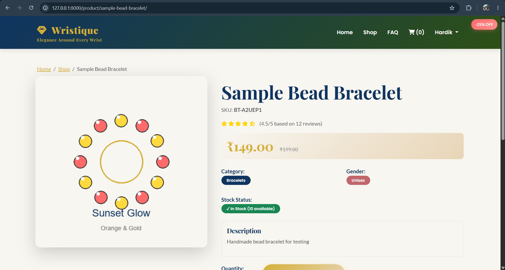
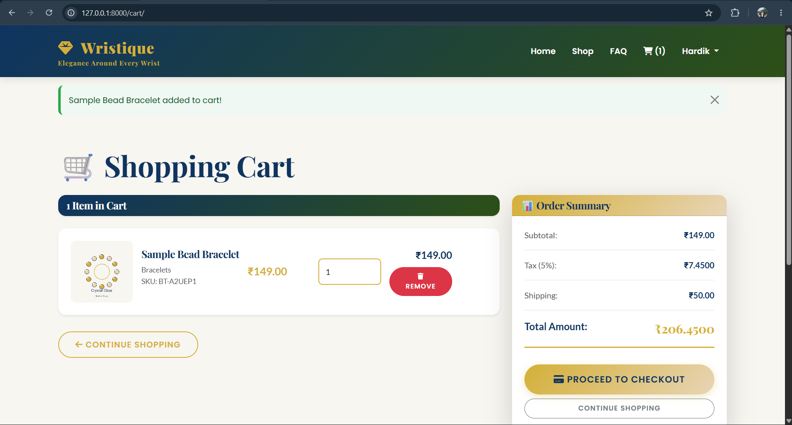
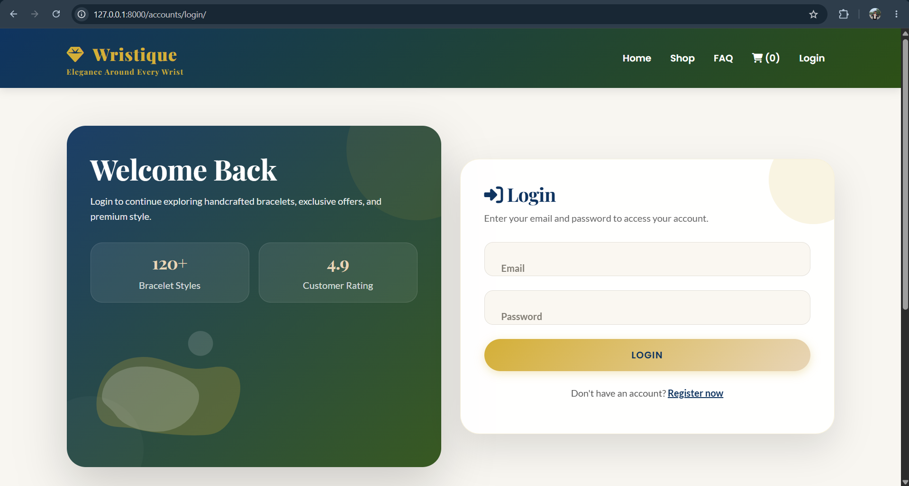

# Wristique E-Commerce

A Django-based e-commerce platform for fashion accessories and bracelets.

## Features
- User Authentication
- Product Catalog
- Shopping Cart
- Order Management
- Admin Dashboard

## Tech Stack
- Python
- Django
- HTML
- CSS
- JavaScript
- SQLite

## Installation
git clone <repo-url>

pip install -r requirements.txt

python manage.py runserver

## Screenshots
## Home Page

## Product Page

## Shopping Cart

## Login Page

## Author
Hardik Patel
